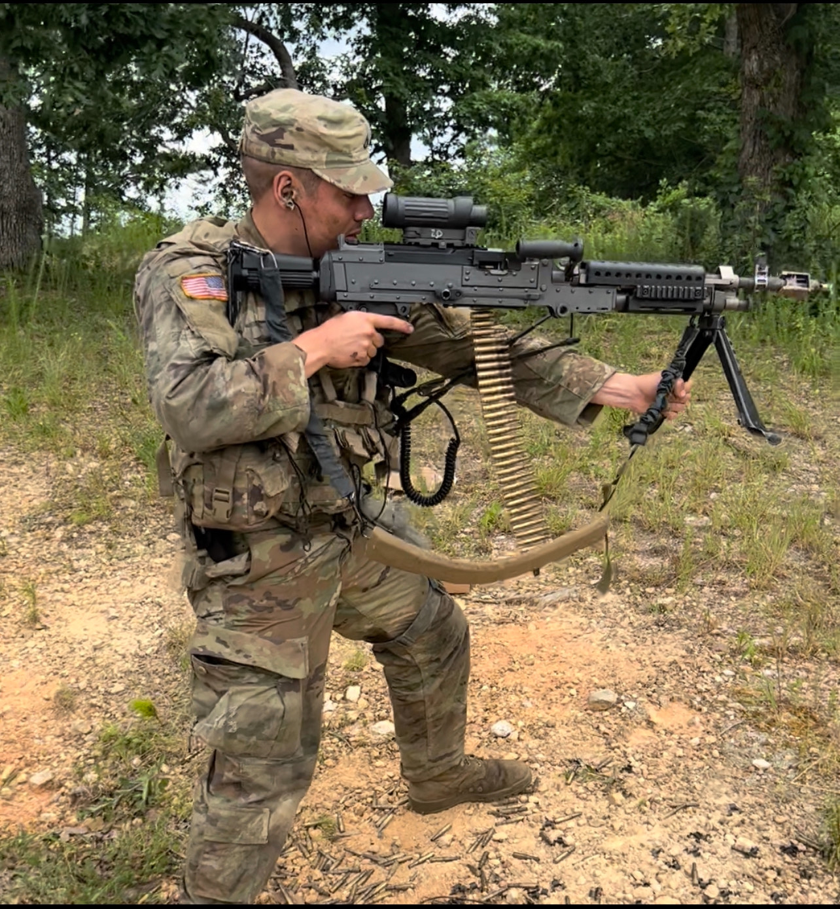
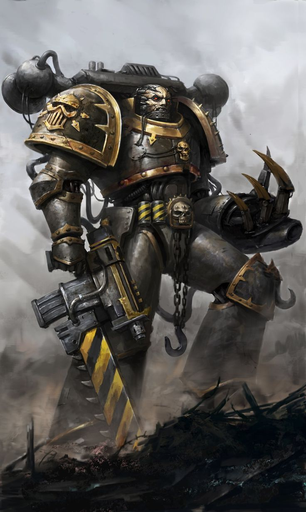

# Welcome!

This is the repository for my Advanced Applied Machine Learning coursework.

You can find my homework under the [`assignments/`](https://github.com/lnxnb/aaml/tree/main/assignments) directory. Click on a directory name to go to it!

## About me

#### Educational and Work History
My name is Ian Conrad and I'm a senior finishing my last semester at William and Mary. I'm majoring in Data Science and Philosophy and I want to become a Machine Learning Engineer some day. Presently, I am planning to work at VISA after I graduate as a Data Analyst, continuing from where I left off as an intern in the summer of 2023. I plan on attending a Master's program in something like Systems Engineering while I work, and after I graduate from that I would like to become an MLE or researcher. VISA is a great company with an excellent culture. I like working for them because I feel that we've contributed significant value to the world by inventing and pioneering cashless payment systems.

My first job was as a cashier at McDonald's when I was 16. Since then I've worked in a grocery store, at a pizza restaurant, in a gym, as a security guard, as a technical analyst at a patent law firm, and of course as a data analyst at VISA. I'm also in the Virginia Army National Guard where I'm an E4 Cavalry Scout. My current role in the unit is as a dismount, which means I ride in the humvee up to a place, get out of the humvee, and shoot people! Hopefully I will never have to shoot anyone for real, but if I do it's important to know what you're doing and do it in a professional manner. Here's a picture of me holding a machine gun!

(Note: I was just posing here. Never hold a machine gun like this when firing)

#### Research/Life Goals

I've enjoyed playing strategy games since I was a kid and one of the most impactful lessons I took from them was that if it's at all possible, you should prioritize long-term sustainable growth of production/resource capacity above all else. For instance, if I'm ever presented with the choice in a game between a large immediate bonus of some kind or, say, a 5% permanent bonus, unless there are some kind of extenuating circumstances then I'll choose the 5% bonus every time, because in the long-term that will almost always be the winning move. I believe that same is true in real life, and specifically I believe that humanity is complete capable of creating a post-scarcity society through the optimization of production and distribution of resources. I believe that AI will be an integral part of this, and that post-singularity AI is not only inevitable but also desireable. For this reason I believe I have a moral obligation to help manifest the singularity as soon as possible, and that's what I want to dedicate my life to. I'm very interested in the concept of self-improving AI and I hope that someday I'll have the skills to meaningfully contribute to the field. In the meantime, I'm just focusing on getting through the day-to-day and improving my skills so that I can.

#### Other Interests

I'm a big fan of the tabletop wargame Warhammer 40k! I have a modest team of Imperial Fist space marines, and they are my favorite faction in the setting. I also like the Iron Warriors, I think that their unfinished industrial aesthetic is super cool.

I also have a brown belt in Judo, and I do Brazilian Jiu-Jitsu/boxing for fun. I am also extremely passionate about green energy and hope to live a carbon-neutral life as soon as I can (get all of my power from my own solar panels, drive an electric car, purchase carbon offsets, etc.) If the opportunity presents itself I would love to someday use my skills in the green energy industry. I'm also a big space nerd and watch almost every big space mission. I'm particularly excited to see us return to the moon with the Artemis program, although the continous delays in the scheduling does have me a bit worried. 
